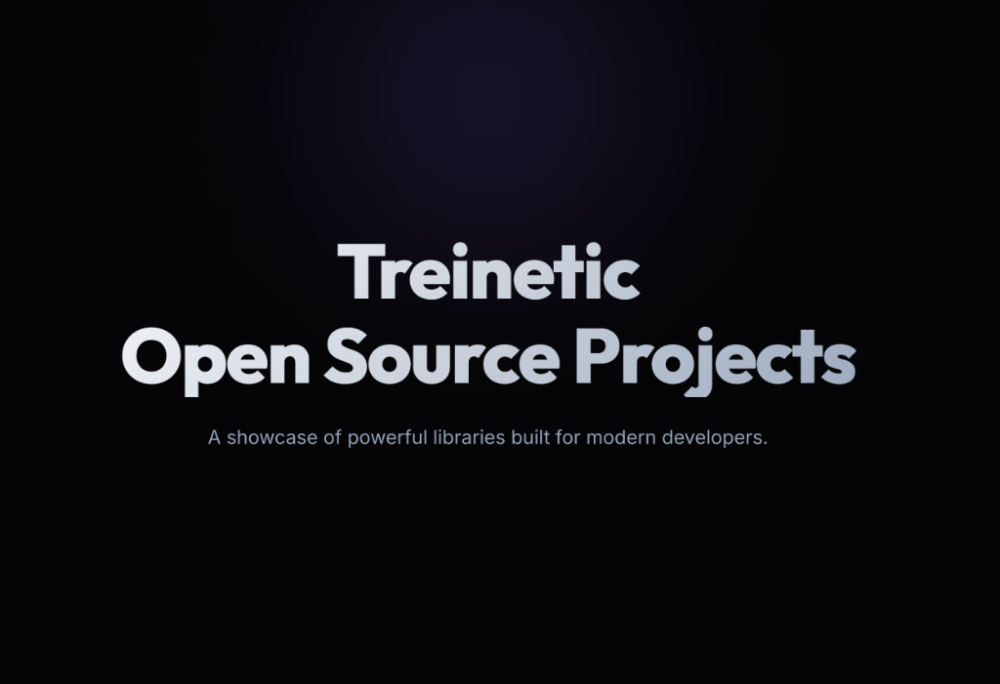

# Treinetic Open Source Projects Showcase

A showcase of powerful libraries built for modern developers.

```bash
docker run -d -p 9090:80 treineticprojects/demo_opensource:latest
```

Welcome to the **Treinetic Open Source Showcase**. 

This interactive application allows you to explore the capabilities of our suite of open-source tools, including powerful **PHP libraries** like PDFLib and ImageArtist, as well as modern **React components** like TreineticEpubReader and VideoRecorderJs.

## 🚀 Projects Showcased

*   **[PDFLib](https://github.com/imalhasaranga/PDFLib)**: A robust library for PDF manipulation (Merge, Split, Encrypt, Convert, OCR, and more).
*   **[ImageArtist](https://github.com/treinetic/ImageArtist)**: An elegant, fluent image manipulation toolkit (Resize, Crop, Overlay, Shapes, Filters).
*   **[VideoRecorderJs](https://github.com/imalhasaranga/VideoRecorderJs)**: Modern HTML5 Video & Screen Recording Library.
*   **[TreineticEpubReader](https://github.com/treinetic/TreineticEpubReader)**: Lightweight framework-agnostic EPUB3 reader.

---

## 🛠️ Getting Started

Follow these steps to set up the project locally.

### Prerequisites

*   **PHP 8.0+** (with GD and Imagick extensions recommended)
*   **Composer**
*   **Nodes.js** (v18+) & **npm**
*   **Ghostscript** (Required for PDFLib features)
*   **Tesseract OCR** (Required for PDFLib OCR features)

> **💡 Quick Setup for Ubuntu**
> You can use the included helper script to install all system and project dependencies at once:
> ```bash
> ./install_dependencies.sh
> ```

### Installation

1.  **Clone the repository:**
    ```bash
    git clone <repository-url>
    cd <project-folder>
    ```

2.  **Install PHP Dependencies:**
    ```bash
    composer install
    ```

3.  **Install Frontend Dependencies:**
    ```bash
    npm install
    ```

### Running with Docker (Recommended)
This is the easiest way to run the project as it handles all system dependencies (PHP, Apache, Ghostscript, OCR) for you.

1.  **Build the Docker Image:**
    ```bash
    npm run docker-build
    ```
    *Note: You do NOT need to run `npm run build` locally. The Docker build handles the frontend build process automatically.*

2.  **Start the Container:**
    ```bash
    npm run docker-run
    ```

    **Or run manually with custom port:**
    ```bash
    docker run -d -p 9090:80 treineticprojects/demo_opensource:latest
    ```

3.  **Access the Application:**
    Open [http://localhost:8080](http://localhost:8080) in your browser.

### Running Locally (Manual Development)

This project consists of a **PHP Backend** (serving API endpoints) and a **React Frontend** (Vite).

**Option 1: Concurrent Command (Recommended)**
```bash
# This runs both the PHP built-in server (port 8000) and Vite dev server (port 5173)
npm run start
```

**Option 2: Manual Start**
1.  Start PHP Server:
    ```bash
    php -S localhost:8000 -t .
    ```
2.  Start Frontend:
    ```bash
    npm run dev
    ```

Access the application at **http://localhost:5173**.

---

## 🚀 Production Deployment

To deploy this project to a live server (Apache/Nginx):

### 1. Build the Frontend
Generate the optimized static assets for the React application.
```bash
npm run build
```
This creates a `dist/` directory containing the `index.html` and assets.

### 2. server Configuration
You need to serve the `dist/` directory as the frontend and ensure the `api/` directory is accessible for PHP requests.

#### **Apache (Recommended)**
Ensure your server has `mod_rewrite` enabled.
1.  Point your `DocumentRoot` to the project folder.
2.  Ensure the `dist/` folder contents are served for the root URL.
3.  Ensure requests to `/api/*` are routed to the `api/` directory.

**Example `.htaccess` at project root:**
```apache
<IfModule mod_rewrite.c>
    RewriteEngine On

    # Serve API requests directly to PHP files
    RewriteRule ^api/ - [L]

    # For all other requests, serve the index.html from dist (SPA Routing)
    RewriteCond %{REQUEST_URI} !^/api/
    RewriteCond %{REQUEST_FILENAME} !-f
    RewriteCond %{REQUEST_FILENAME} !-d
    RewriteRule ^ index.html [L]
</IfModule>
```
*Note: You may need to copy `dist/index.html` and `dist/assets` to the root for the above simple config, or alias the DocumentRoot to `dist/` and alias `/api` back to the root `api/` folder depending on your preference.*

#### **Nginx**
```nginx
server {
    listen 80;
    server_name example.com;
    root /path/to/project/dist; # Serve the build output by default
    index index.html;

    # Frontend Routing (SPA)
    location / {
        try_files $uri $uri/ /index.html;
    }

    # API Requests
    location /api/ {
        alias /path/to/project/api/; # Point to the actual API source code
        try_files $uri $uri/ =404;

        location ~ \.php$ {
            include fastcgi_params;
            fastcgi_param SCRIPT_FILENAME $request_filename;
            fastcgi_pass unix:/var/run/php/php8.2-fpm.sock; # Adjust PHP version
        }
    }
}
```

### 3. Environment Config
The build process automatically sets the API base URL to be relative (e.g., `/api/...`) instead of `localhost:8000`. Ensure your server serves the API at the same domain/origin as the frontend.

---

## 🎨 Development Guidelines

We strive for a consistent, premium "Developer Aesthetic" across all our demos. If you are contributing a new demo page or modifying an existing one, strictly adhere to our design rules.

### Creating a New Demo Page

Please refer to the **[Demo Page Rules](./demopagerules.md)** document for detailed instructions on:
*   Directory Structure
*   Component Hierarchy (`App.jsx`)
*   Design System (Colors, Typography, CSS Variables)
*   Feature Card Layouts

### Technical Note
*   **Frontend**: Built with React and Vite. Styling is handled via pure CSS (Variables) in `src/index.css`. **Do not use Tailwind CSS**.
*   **Backend**: Plain PHP scripts located in `api/`. Each library has its own subdirectory (e.g., `api/pdflib/`, `api/imageartist/`).
*   **Routing**: Handled via `react-router-dom` in `src/App.jsx`.

---

## 📄 License

This project is open-source and available under the MIT License.
